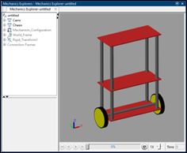

# Self-Balancing Robot Control with Differential Evolution

This project implements a control system for a self-balancing robot using PID control and optimization via Differential Evolution (DE). The work was developed as part of the Master's in Robotics and Automation.

## Project Description

The main objective of this project is to design and tune a control system in MATLAB Simulink that allows a two-wheeled robot to autonomously maintain its balance. This was achieved by modeling the robot as an inverted pendulum and applying PID controllers for stabilization. The control parameters are tuned using two methods:

1. **PID Tuner**: MATLAB’s tool for automatic PID parameter tuning.
2. **Differential Evolution Algorithm**: A global optimization algorithm based on genetic evolution to refine PID parameters and optimize robot performance.

## Demonstration Video

For an overview of the project and its functionality, watch the following YouTube video:

### Project Structure

1. **Robot Modeling**: Creating the robot model in Simscape Multibody. Model is inspired by Mouad Boumediene's
   
3. **PID Control**: Implementing a PID system to control the balance angle.
   
5. **Parameter Optimization**:
   - **PID Tuner**: Automatic parameter tuning.
   - **Differential Evolution**: Tuning through global optimization.

### Results and Comparison

Experiments show that both methods effectively stabilize the robot, though tuning via Differential Evolution provides slightly better performance in terms of overshoot and stabilization time.

| Parameter                     | PID Tuner | Differential Evolution |
|-------------------------------|-----------|------------------------|
| Overshoot (°)                 | 12.21     | 11.80                 |
| Stabilization Time (s)        | 2.32      | 1.98                  |
| Steady-State Error            | 0.0021    | 0.0015                |

## Requirements

- MATLAB with Simulink and Simscape Multibody.
- PID Tuner tool (System Control Toolbox).
- Differential Evolution algorithm code in MATLAB.

## How to Run the Project

1. Clone the repository and open the main file in MATLAB.
2. Run the Simulink simulation to observe the control system's performance.
3. Adjust the Differential Evolution algorithm parameters in the `SolucionAutobalanceable.m` script to experiment with different tuning configurations.

## Conclusion

The project concludes that tuning with Differential Evolution offers a robust alternative to automatic PID Tuner adjustments, achieving efficient control of the self-balancing robot. Both methods meet the objectives of balance and stable response.

## References

1. Z. Li, *Advanced Control of Wheeled Inverted Pendulum Systems*. Springer, 2013.
2. B. V. Kumar, D. Oliva, and P. N. Suganthan, *Differential Evolution: From Theory to Practice*, Springer, 2022.
